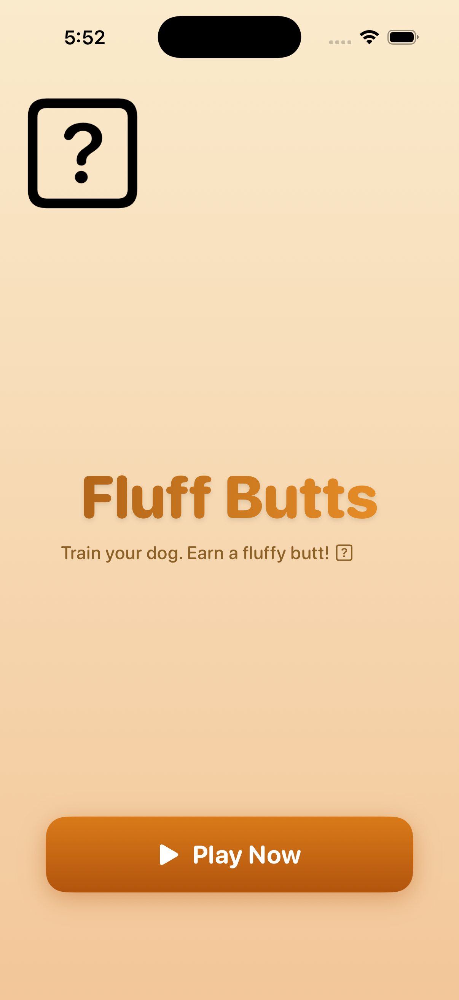
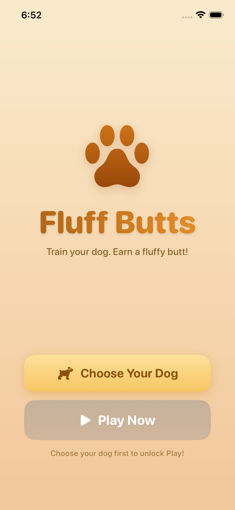
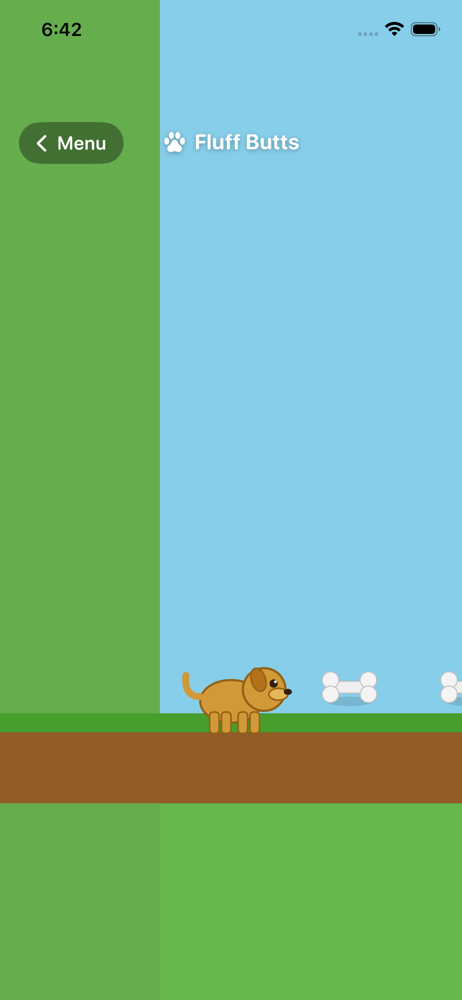

# 🐾 Fluff Butts

> *Train your dog. Earn a fluffy butt.*

A fun iOS dog training game built by **Emma** (with a little help from Linda 🌿).

---

## What Is This Game?

You drop bones 🦴 on the screen and your dog chases them through an obstacle course. How well you do affects how fluffy your dog's butt looks at the end!

- **Good run** → clean, fluffy butt 🐾
- **Bad run** → messy butt 💩

---

## Choose Your Dog

| | Memphis | Lincoln |
|---|---|---|
| **Breed** | Golden Retriever | Black Lab |
| **Difficulty** | Easy 🟢 | Hard 🔴 |
| **Special move** | Deer hop 🦌 | Feisty sprint ⚡ |
| **Personality** | Fun & bouncy | Stubborn & feisty |
| **Hates** | Nothing! | Water 💦 |

Memphis and Lincoln are inspired by Emma's real dogs! 🦮🐕

---

## Screenshots

### Home Screen


### Dog Selection


### Memphis in action


---

## How To Play

1. **Choose your dog** — Memphis (easy) or Lincoln (hard)
2. **Tap the screen** to drop a bone 🦴
3. Your dog chases the nearest bone
4. Navigate past rock obstacles to reach the finish line 🏁
5. **Grooming mini-game** — the better your run, the fluffier the butt!

---

## Grooming Tiers (Emma's Design)

| Stars | Result |
|---|---|
| ⭐⭐⭐ | Quick fluff — already fluffy! |
| ⭐⭐ | Needs brushing |
| ⭐ | Full blow dry needed |
| Lincoln swam | Maximum blow dry — soaking wet 😂 |

---

## Progress

### ✅ Done
- [x] Loading screen with animated paw icon
- [x] Dog selection screen (Memphis vs Lincoln)
- [x] Dog walks around selection screen after chosen
- [x] Play Now locked until a dog is selected
- [x] SpriteKit game scene with physics
- [x] Dog character drawn with SKShapeNode (golden for Memphis, black for Lincoln)
- [x] Bone treats drawn with SKShapeNode
- [x] Dog chases nearest bone on tap
- [x] Rock obstacle course
- [x] Finish line trigger
- [x] Camera follows dog through course
- [x] Pre-placed bones at start of course
- [x] Breed carries through from selection to game

### 🔜 Coming Next (Phase 2)
- [ ] Memphis deer hop special move
- [ ] Lincoln stubborn mode (randomly stops mid-course)
- [ ] Grooming mini-game with star tiers
- [ ] Sound effects
- [ ] Score / star system
- [ ] Real dog sprite art (replacing drawn shapes)
- [ ] More obstacle types
- [ ] Swimming level (Lincoln's nightmare 💦)

---

## Tech Stack

- **Swift 6** + **SwiftUI** + **SpriteKit**
- iOS 17+
- Built with Xcode 26.3 on macOS 26.3.1
- Project generated with [XcodeGen](https://github.com/yonaskolb/XcodeGen)

---

## Build Instructions

```bash
# Clone the repo
git clone https://github.com/lindapai123/fluff-butts.git
cd fluff-butts

# Generate the Xcode project
brew install xcodegen
xcodegen generate

# Open in Xcode
open FluffButs.xcodeproj
```

Then select an iPhone simulator or your device and press **⌘R** to build and run.

---

## Running on Your iPhone (Free)

1. Open `FluffButs.xcodeproj` in Xcode
2. Plug your iPhone in via USB
3. Go to **Xcode → Settings → Accounts** → add your Apple ID
4. Select your iPhone as the build target
5. Hit **⌘R** — Xcode signs and installs it automatically

> ⚠️ Free developer accounts require re-running every 7 days. For longer installs, grab an [Apple Developer account](https://developer.apple.com/programs/) ($99/year).

---

## Game Design

Full design spec lives in [GAME_DESIGN.md](GAME_DESIGN.md) — Emma's ideas in her own words!

---

*Made with 🐾 by Emma*
