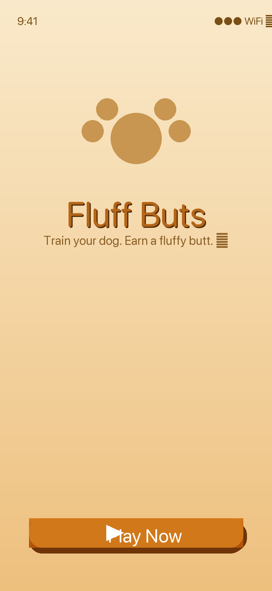

# 🐾 Fluff Buts

> *Train your dog. Earn a fluffy butt.*

A fun dog training iOS game built by **Chris & Emma** — inspired by their real dogs Memphis (🦮 golden retriever) and Lincoln (🐾 lab).

---

## 📱 App Preview

<p align="center">
  
</p>

---

## 🎮 Game Concept

Guide your dog through obstacle courses by dropping **toys and treats** (like bones) to steer them in the right direction. At the end of each course, you groom your dog's fluffy butt — and how well you did affects the result!

- 🐾 **Good run** → clean, fluffy butt
- 💩 **Bad run** → messy butt

---

## 🐕 Dog Breeds

Emma's picks (inspired by her real dogs!):

| Breed | Inspiration |
|-------|------------|
| Golden Retriever | Memphis 🦮 |
| Labrador | Lincoln 🐾 |
| King Charles Spaniel | |
| Pug | |
| Dachshund | |

---

## 🛠️ Tech Stack

| Tool | Purpose |
|------|---------|
| **Swift** | Primary language |
| **SwiftUI** | UI framework |
| **SpriteKit** | 2D physics & gameplay |
| **Xcode** | IDE |
| **iOS 17+** | Target platform |

---

## 📋 Build Plan

### Phase 1 — Foundation
- [x] SwiftUI project scaffolded
- [x] Loading screen with Play Now button
- [ ] Install Xcode & verify builds on simulator
- [ ] Basic SpriteKit scene with a simple obstacle course
- [ ] Dog character with physics body
- [ ] Treat/toy dropping mechanic (tap to drop)

### Phase 2 — Core Gameplay
- [ ] Steering/guidance system (treats attract the dog)
- [ ] Multiple dog breed selection screen
- [ ] Dog animations (run, swim, jump)
- [ ] End-of-course grooming sequence
- [ ] Clean vs. messy butt outcome system

### Phase 3 — Skill Courses
- [ ] Swimming course 🏊
- [ ] Agility course 🏃
- [ ] More skill types TBD
- [ ] Course progression & unlocks

### Phase 4 — Polish & Launch
- [ ] Sound effects & background music
- [ ] Scoring & leaderboard
- [ ] App icon & splash screen
- [ ] App Store submission

---

## 🚀 Getting Started

### Prerequisites
- macOS 14+
- Xcode 16+ (download from the [App Store](https://apps.apple.com/app/xcode/id497799835))

### Run the App
```bash
git clone https://github.com/lindapai123/fluff-buts.git
cd fluff-buts
open FluffButs.xcodeproj
```

Then select an iPhone simulator in Xcode and press **⌘R** to run.

---

## 🌿 Built with love (and a little AI help)

*Linda the AI assistant helped scaffold this project. The ideas, inspiration, and dog breeds are 100% Emma's.*
